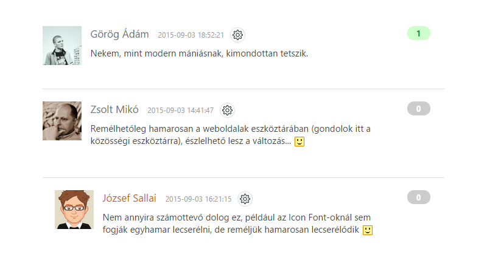

# Hozzászólások modern kinézete



Egy modern, egyszerű és letisztult módja a hozzászólások megjelenítésének.

## Telepítés

A Stílusok táblázata (CSS) sablon végére illeszd be az alábbi kódot: 

```css
.comment_over {margin-top:20px;padding-bottom:15px;border-bottom:1px solid #dedede}  
.comment {display:table;width:100%;}  
.comment_avatar {display:table-cell;vertical-align:top;width:64px;padding-right:15px}  
.comment_message {display:table-cell;vertical-align:top;text-align:left}  
.comment_rate {display:table-cell;vertical-align:top;text-align:center;width:80px}  
.comment_top {padding-top:2px;padding-bottom:7px;font-size:17px;line-height:20px}  
.comment_top a {text-decoration:none;color:#6c6c6c}  
.comment_top .comm_time {font-size:12px;color:#9c9c9c;display:inline-block;padding-left:10px}  
.comment_message_in {font-size:15px}  
.comment_over:hover .comment_answer_button a {display:inline-block}  
.comment_over:hover .c_rate_plus a, .comment_over:hover .c_rate_minus a {display:block}  
.comment_answer_button {margin-top:10px;height:24px}  
.comment_answer_button a {display:none;color:#666;font-size:13px;text-decoration:none;background:#efefef;padding:3px 10px;-webkit-border-radius: 3px;-moz-border-radius: 3px;border-radius: 3px}  
.comment_answer_button a:hover {color:#1d1d1d;text-decoration:none;background:#eaeaea;}  
.c_minus, .c_ziro, .c_plus {width:38px;padding:3px 0px;font-size:13px;text-align:center;font-weight:bold;-webkit-border-radius: 20px;-moz-border-radius: 20px;border-radius: 20px}  
.c_minus {background:#ffcccc;color:#cc0000}  
.c_ziro {background:#cccccc;color:#FFF}  
.c_plus {background:#ccffcc;color:#009900}  
.c_rate_t {display:table;height:24px}  
.c_rate_plus {display:table-cell;vertical-align:top;width:22px;}  
.c_rate_minus {display:table-cell;vertical-align:top;width:22px;}  
.c_rate_count {display:table-cell;vertical-align:top;width:46px;padding-left:3px;text-align:center}  
.c_rate_plus a {width:18px;height:18px;display:none;color:rgba(0,0,0,0);font-size:0px;background:url('http://ucoztaska.ucoz.hu/assets/images/like.png');margin-top:3px;opacity:0.5;position:absolute}  
.c_rate_minus a {width:18px;height:18px;display:none;color:rgba(0,0,0,0);font-size:0px;background:url('http://ucoztaska.ucoz.hu/assets/images/unlike.png');margin-top:3px;margin-left:-5px;opacity:0.5;position:absolute}  
.c_rate_plus a:hover, .c_rate_minus a:hover {opacity:1}
```

A **Hozzászólások kinézete** sablon tartalmát cseréld erre: 

```html
<div class="comment_over">  
<div class="comment">  
<div class="comment_avatar"><a href="$PROFILE_URL$">$USER_AVATAR_URL$<?else?>http://ucoztaska.net/assets/images/usericon.png<?endif?>" width="64" alt="" /></a></div>  
<div class="comment_message">  
  <div class="comment_top"><?if($USERNAME$)?><a href="$PROFILE_URL$">$NAME$</a><?else?>$NAME$<?endif?> <span class="comm_time">$DATE$ $TIME$<?if($ENTRY_URL$)?> / <a href="$ENTRY_URL$">Anyag</a><?endif?></span>$MODER_PANEL$</div>  
<div class="comment_message_in">$MESSAGE$</div>  
<?if($ANSWER_URL$)?><div class="comment_answer_button"><a href="$ANSWER_URL$">Válasz</a></div><?endif?>  
</div>  
<div class="comment_rate">  
<div class="c_rate_t">  
<div class="c_rate_minus"><?if($BAD_COMMENT_URL$)?><a href="$BAD_COMMENT_URL$">-</a><?endif?></div>  
<div class="c_rate_count"><?if($COMMENT_RATING$<0)?><div class="c_minus">$COMMENT_RATING$</div><?else?><?if($COMMENT_RATING$=0)?><div class="c_ziro">0</div><?else?><div class="c_plus">$COMMENT_RATING$</div><?endif?><?endif?></div>  
<div class="c_rate_plus"><?if($GOOD_COMMENT_URL$)?><a href="$GOOD_COMMENT_URL$">+</a><?endif?></div>  
</div>  
</div>  
</div>  
</div>
```

A kódban cseréld ki a http://ucoztaska.net/assets/images/usericon.png linket a saját noavatar képedre. 

*Forrás: http://yraaa.ru/scripts/vid-kommentariev-kak-na-yraaa*
