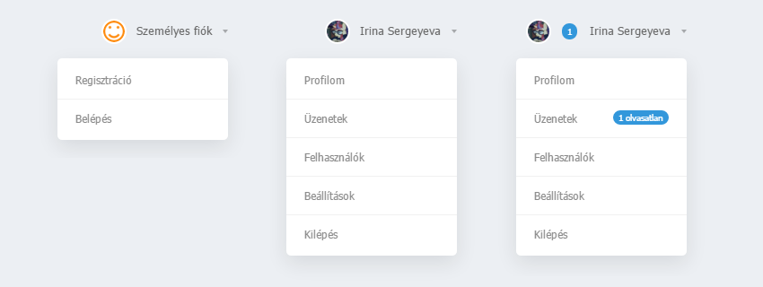

# Legördülő felhasználói menü



Egy kis menü, amely bármilyen stílusú weboldalon tökéletesen megjelenik. A menüelemek a kurzorral való rámutatáskor jelennek meg. A menü az olvasatlan privát üzeneteket is jelzi.

A telepítése roppant egyszerű - mindössze pár perc az egész.

1. Vezérlőpult » Honlap-stílus » Külalak szerkesztése » Stílusok táblázata (CSS). A sablon végére illeszd be ezt a kódot: 

```css
.profile {height:30px;font-size:13px;display:inline-block;position:relative}  

.profile-menu {position:relative!important}  
.profile-button s {display:inline-block;z-index:9;background:#3297db;color:#fff;font-size:10px;margin-right:10px;margin-left:1px;line-height:14px;padding:2px 6px;text-decoration:none;-webkit-border-radius: 55px;-moz-border-radius: 55px;border-radius: 55px;}  
.profile-button, .profile-button:hover {display:inline-block;color:#666;position:relative;line-height:30px;padding-left:39px;padding-right:18px;text-decoration:none}  
.profile-button i {position:absolute;right:0px;top:14px;width: 0;height: 0;border-left: 3px solid transparent;border-right: 3px solid transparent;border-top: 4px solid rgba(0,0,0,0.3);}  
.profile-avatar, .profile-avatar img {-webkit-border-radius: 100px;-moz-border-radius: 100px;border-radius: 100px;}  
.profile-avatar {display:inline-block;width:24px;height:24px;position:absolute;top:-0px;left:0px;border-radius: 20px;}  
.profile-avatar img {width:24px;height:24px;object-fit:cover;vertical-align:bottom;background:#fff;border:2px solid #fff}  

.profile-menu:hover .profile-list {visibility:visible;}  
.profile-list {position:absolute;width:190px!important;right:0px!important;top:28px;padding-top:18px;visibility:hidden;z-index:9;}  
.profile-list-in {background:#fff;width:190px!important;max-width:190px!important;padding:3px 0px;box-shadow:0px 8px 35px rgba(0,0,0,0.1);-webkit-border-radius: 5px;-moz-border-radius: 5px;border-radius: 5px;}  
.profile-list-in a {display:block;padding:0px 20px!important;line-height:42px!important;text-decoration:none;text-align:left;border-bottom:1px solid #f1f1f1;font-size:12px;color:#8a8a8a}  
.profile-list-in a:hover {color:#000;}  
.profile-list-in a.last {border-bottom:0px !important}  
.profile-list-in a i {background:#3297db;color:#fff;float:right;font-style:normal;font-size:10px;padding:0px 6px;line-height:16px !important;margin-top:12px;-webkit-border-radius: 20px;-moz-border-radius: 20px;border-radius: 20px;}
```

2. Illeszd be ezt a kódot oda, ahol a menüt akarod látni: 

```html
<?if($USER_LOGGED_IN$)?>  

<div class="profile">  
<div class="profile-menu">  
  <a href="$PERSONAL_PAGE_LINK$" class="profile-button"><?if($UNREAD_PM$>0)?><s>$UNREAD_PM$</s><?endif?><span class="profile-avatar">$USER_AVATAR_URL$<?else?>/.s/t/1090/logo-img.png<?endif?>" alt="" /></span> <?if($USER_FULL_NAME$)?>$USER_FULL_NAME$<?else?>$USERNAME$<?endif?> <i></i></a>  
  <div class="profile-list">  
  <div class="profile-list-in">  
  <a href="$PERSONAL_PAGE_LINK$">Profilom</a>  
  <a href="$PM_URL$"><?if($UNREAD_PM$>0)?><i>$UNREAD_PM$ olvasatlan</i> Üzenetek<?endif?></a>  
  <a href="$USERS_LIST_URL$">Felhasználók</a>  
  <a href="/index/11">Beállítások</a>  
  <a href="$LOGOUT_LINK$" class="last">Kilépés</a>  
  </div>  
  </div>  
</div>  
</div>  

<?else?>  

<div class="profile">  
<div class="profile-menu">  
  <a href="$PERSONAL_PAGE_LINK$" class="profile-button"><span class="profile-avatar"></span> Személyes fiók <i></i></a>  
  <div class="profile-list">  
  <div class="profile-list-in">  
  <a href="$REGISTER_LINK$">Regisztráció</a>  
  <a href="$LOGIN_LINK$" class="last">Belépés</a>  
  </div>  
  </div>  
</div>  
</div>  

  <?endif?>
```

*Forrás: http://yraaa.ru/scripts/mini-profil-ucoz*
