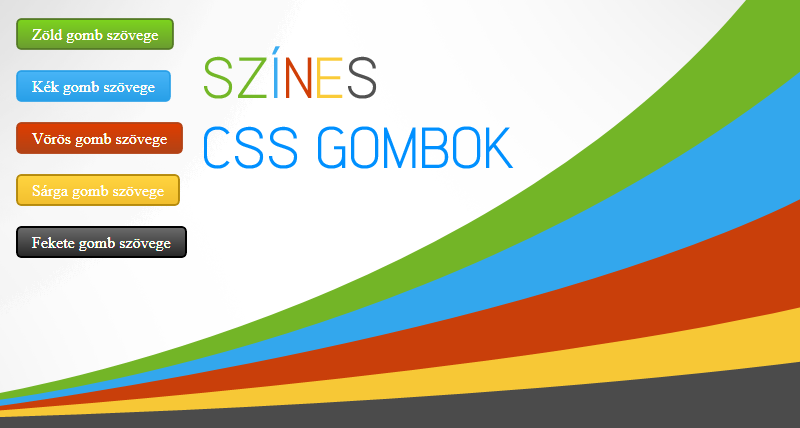

# Színes CSS gombok



A kód segítségével színes, modern CSS-gombokat helyezhetünk el honlapunkon.

A **Stílusok táblázata (CSS)** sablonba illesszük a következő kódot: 

```css
/* --- KovJonas CSS gombok ---*/  
.btnRed {  
  display: inline-block;  
  color: #de3d00 !important;  
  text-shadow: 0px 0px 0px rgb(254, 243, 151);  
  text-align: center;  
  border: 2px solid #b34215;  
  background-color: #de3d00;  
  background-image: -moz-linear-gradient(center top , #de3d00, #b34215);  
  border-radius: 5px 5px 5px 5px;  
  padding: 4px 14px;  
  cursor: pointer;  
}  

.btnBlue {  
  display: inline-block;  
  color: #47b4f6 !important;  
  text-shadow: 0px 0px 0px rgb(254, 243, 151);  
  text-align: center;  
  border: 2px solid #29a0e8;  
  background-color: #47b4f6;  
  background-image: -moz-linear-gradient(center top , #47b4f6, #29a0e8);  
  border-radius: 5px 5px 5px 5px;  
  padding: 4px 14px;  
  cursor: pointer;  
}  

.btnGreen {  
  display: inline-block;  
  color: #a3e754 !important;  
  text-shadow: 0px 0px 0px rgb(254, 243, 151);  
  text-align: center;  
  border: 2px solid #547A25;  
  background-color: #6BB51A;  
  background-image: -moz-linear-gradient(center top , #7CD21E, #6B9D2F);  
  border-radius: 5px 5px 5px 5px;  
  padding: 4px 14px;  
  cursor: pointer;  
}  

.btnYellow {  
  display: inline-block;  
  color: #ffd43f !important;  
  text-shadow: 0px 0px 0px rgb(254, 243, 151);  
  text-align: center;  
  border: 2px solid #B58A0B;  
  background-color: #E8B400;  
  background-image: -moz-linear-gradient(center top , #ffd43f, #f2bf2f);  
  border-radius: 5px 5px 5px 5px;  
  padding: 4px 14px;  
  cursor: pointer;  
}  

.btnBlack {  
  display: inline-block;  
  color: #ffd43f !important;  
  text-shadow: 0px 0px 0px rgb(254, 243, 151);  
  text-align: center;  
  border: 2px solid #000000;  
  background-color: #292929;  
  background-image: -moz-linear-gradient(center top , #ffd43f, #f2bf2f);  
  border-radius: 5px 5px 5px 5px;  
  padding: 4px 14px;  
  cursor: pointer;  
}  
/* --- ------------------ ---*/
```

Fontos megjegyezni az osztályneveket:

 - **btnGreen** - zöld
 - **btnBlue** - kék
 - **btnRed** - piros
 - **btnYellow** - sárga
 - **btnBlack** - fekete

Most ezt a kódot a kívánt gomb és a tartalom szerint módosítjuk és beillesztjük ahová csak akarjuk:

```html
<div class="btnGreen"><span style="color:white">Zöld gomb szövege</span></div>
```

A **btnGreen** osztályt a kívánt gomb nevével módosítjuk, a tartalmat meg természetesen cseréljük.