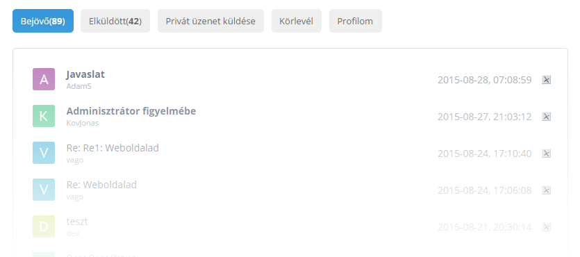

# Vadonatúj külső a privát üzenetek oldalának



**LETÖLTÉS: https://mega.nz/#!qZs1hBDS!6NoLSjAm6NISjFUzrrGDcdesxnAihANuh2MdxFUkG_c**

Modern, stílusos és remek privát üzenetek oldal, mindössze pár lépés elvégzésével!

## Miben más?

Először is kinézetben. Egy letisztult, modern és stílusos PM-oldalt kapunk. Másrészt, a szerző neve mellett megjelenik a felhasználónevének a kezdőbetűje. Az oldal fő tulajdonsága, hogy egyszerű, de nagyszerű!

Egyetlen egy hátránya van: meg kell válni a vizuális hozzászólás-szerkesztőtől. Ehhez menj a Vezérlőpult » Beállítások » Általános beállítások oldalra és pipáld be a **Ne használd a vizuális szerkesztőt** mezőt. 

## Telepítés

1. Töltsd fel a **newpm** mappát a tárhelyedre.

2. **Vezérlőpult » Külalak szerkesztése » Privát üzenetek**. Cseréld le a sablon tartalmát a következőre: 

```html
<!DOCTYPE html>  
<html>  
<head>  
<title>$TITLE$</title>  
<meta name="viewport" content="width=device-width; initial-scale=0.85; maximum-scale=0.85; user-scalable=0;" />  
<script type="text/javascript" src="http://s43.ucoz.net/src/jquery-1.6.1.js"></script>  
<link href='http://fonts.googleapis.com/css?family=Open+Sans:400,700' rel='stylesheet' type='text/css'>  
<link href='/newpm/style.css' rel='stylesheet' type='text/css'>  
</head>  
<body>  

<div align="center">  
<div class="block">  
<div class="pmb">  
$BODY$  
</div>  
</div>  
</div>  

<script type="text/javascript">  
$('body').each(function () {  
$(this).html($(this).html().replace(/\[|\||\]/g, ''));  
});  
</script>  
<script type="text/javascript">$("#ugr1, #ugr2, #ugr3, #ugr251").attr("checked","checked")</script>  
<script type="text/javascript" src="/newpm/script.js"></script>  

</body>  
</html>
```

*Forrás: http://yraaa.ru/publ/ucoz/22-1-0-2490*
