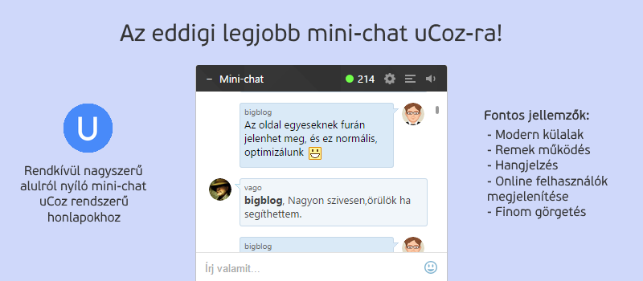
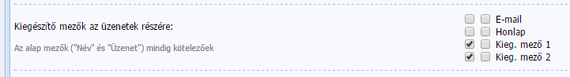
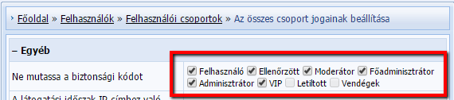
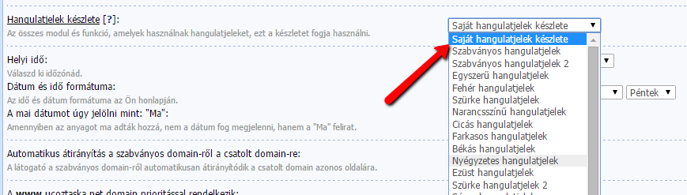

# Vadonatúj mini-chat uCoz-ra



**LETÖLTÉS: Töltsd le az `src` mappában levő `chat_files.zip` fájlt**

Modern, kényelmes és funkcionális - ahogy azt a mini-chat szkript megalkotói, az yraaa.ru mondaná.

Az Yraaa már eleve létrehozott egy ilyen szkriptet a múltban, ez viszont a javított, sokkal modernebb és funkcionálisabb változata a réginek.

## Fontosabb jellemzők:

Bár a fontosabb jellemzők ugyanúgy megtalálhatóak az anyag főcímképén, szeretnénk itt is megemlíteni őket:

 - Modern, letisztult megjelenés
 - Teljesen funkcionális
 - Az új üzenetek automatikusan betöltődnek
 - Hangjelzés új üzenet érkezésekor
 - Finom görgetés
 - Online felhasználók/látogatók megjelenítése
 - Hangulatjelek

*Megj.: A mini-chat mobileszközök esetében nem jelenik meg.*

---

## Telepítés:

1. Amennyiben még nem tetted meg, aktiváld a Mini-chat modult, majd engedélyezd a **Kieg. mező 1** és **Kieg. mező 2** mezők megjelenítését a modul beállításaiban. 



2. A **Felhasználók » Felhasználói csoportok » Az összes csoport jogainak beállítása » Egyéb** szekcióban jelöld be az összes bejelölhető jelölőnégyzetet a **Ne mutassa a biztonsági kódot** opció mellett. 



3. Egy FTP kliens segítségével töltsd fel a tárhelyedre a **chat_files** és **smiles** mappákat. 

4. **Vezérlőpult » Honlap-stílus » Külalak szerkesztése » Stílusok táblázata (CSS)**. A sablon végére illeszd be ezt a kódot: 

```css
.chat_over{background:rgba(0,0,0,.6);right:20px;position:fixed;padding:0;padding-top:0;z-index:9999;bottom:-182px;text-align:center;font-size:13px;box-shadow:0 1px 3px rgba(0,0,0,.3)}
.chat_over *{outline:none}
.chat_over .jspTrack{height:160px!important}
.chat_over,.ch_sml,.ch_smlin,.uuslugi,.new_comment_error,.forum_get,.comment_answer_button a,.quoteMessage,.premium .prc,.siteRate,.siteRate div,.sb1,.sb2,.chatRight,.gChat,.gChat:hover,.over_ind,.ind,.info_signs,.column_1,.column_c,.column_2,.jspDrag{-webkit-border-radius:3px;-moz-border-radius:3px;border-radius:3px}
.smile_in,.ch_smlin img,.sound_on,.sound_off,#setting_chat a,#rules_chat a,#sound_chat div,.hm,.ch_sml,.jspDrag{transition:all linear .1s;-moz-transition:all linear .1s;-webkit-transition:all linear .1s;-o-transition:all linear .1s}
.comm .us{color:#646464;font-size:10px;margin-top:-2px;padding:0}
.comm .us a{text-decoration:none}
.comm .us .us_name{color:#646464}
.comm .av{margin-right:10px;width:28px;height:28px;overflow:hidden;-webkit-border-radius:50px;-moz-border-radius:50px;border-radius:50px}
.comm .av img{width:28px;height:28px;object-fit:cover;-webkit-border-radius:250px;-moz-border-radius:250px;border-radius:250px}
.comm .chatInner{width:222px;overflow:hidden;margin-bottom:2px}
.cerr{float:right;padding:7px;padding-right:20px}
.hm{visibility:hidden;position:absolute;height:0;margin-top:-10px;overflow:hidden;opacity:0;top:-34px;right:0;background:rgba(0,0,0,.8);padding:5px 10px;color:#fff;font-size:11px;-webkit-border-radius:3px;-moz-border-radius:3px;border-radius:3px}
#online_counter:hover span,#rules_chat:hover span,#setting_chat:hover span,.sound_on:hover span,.sound_off:hover span{opacity:1;height:auto;margin-top:0;visibility:visible}
#c_one_clon,#c_tell{position:absolute;top:-1500px;right:-15000px}
#setting_chat a,#rules_chat a,#sound_chat div{width:16px;height:16px;display:inline-block;opacity:.5;cursor:pointer}
#setting_chat a:hover,#rules_chat a:hover,#sound_chat div:hover{opacity:.9}
#setting_chat,#rules_chat,#sound_chat{float:right;margin-right:10px;margin-top:8px}
#setting_chat a{background:url(/chat_files/chat-sprite.png) 0 -23px no-repeat}
#rules_chat a{background:url(/chat_files/chat-sprite.png) -39px -21px no-repeat}
#sound_chat .sound_on{background:url(/chat_files/chat-sprite.png) -19px -21px no-repeat}
#sound_chat .sound_off{background:url(/chat_files/chat-sprite.png) -19px -35px no-repeat;display:none}
#online_counter{float:right;color:#FFF;margin-top:4px;margin-right:8px;padding:4px;padding-left:16px;background:url(/chat_files/chat-sprite.png) -32px 3px no-repeat;cursor:pointer;font-size:13px}
#bottom_chat span,#top_chat span{display:inline-block;width:17px}
#bottom_chat,#top_chat{text-align:left;padding:8px 12px;color:#FFF;cursor:pointer;font-size:13px}
#bottom_chat,.chtt iframe{display:none}
.ngd{background:#fff;padding:10px;cursor:default}
.jspContainer{background:none!important}
.pdvr{float:right;opacity:0}
.msg:hover .pdvr{opacity:1}
.clkg{font-size:11px;padding:10px;background:#efefef;-webkit-border-radius:0 0 3px 3px;-moz-webkit-border-radius:0 0 3px 3px;border-radius:0 0 3px 3px}
.cs2{margin-top:3px;color:#E32F17;font-size:10px}
.cs1{margin-top:3px;color:#2B2B2B;font-size:10px}
.mchat{width:250px}
.chtt{border-top:1px solid #e2e2e2}
#mchatMsgF{margin:0!important;max-width:100%!important;min-height:auto!important;width:312px;padding:0 10px!important;height:36px!important;padding-right:53px!important;border:1px solid #fff;background:#fff;-webkit-border-radius:0 0 3px 3px;-moz-webkit-border-radius:0 0 3px 3px;border-radius:0 0 3px 3px;-webkit-box-sizing:border-box;-moz-box-sizing:border-box;box-sizing:border-box;}
#mchatBtn{position:absolute;top:-1200px;right:-1500px}
#mchatAjax{background:#646464;position:absolute;right:-200px}
.ch_sml{z-index:99999999;height:0;opacity:0;overflow:hidden;margin-top:-98px;right:0;position:absolute}
.ch_smlin{width:157px;height:70px;background:#FFF;overflow:hidden;text-align:left;border:1px solid rgba(0,0,0,.2)}
.ch_smlin img{padding-left:3px;padding-top:3px;float:left;cursor:pointer}
.ch_smlin img:hover{opacity:.7}
.smile_in:hover .ch_sml{height:85px;opacity:1;margin-top:-78px}
.smile_in span{opacity:.5}
.smile_in span:hover{opacity:.8}
.smile_in{z-index:3;position:absolute;margin-left:284px}
.smile_in span{display:inline-block;margin-top:9px;cursor:pointer;width:19px;height:19px;background:url(/chat_files/chat-sprite.png) -8px 0;opacity:.5}
.otbv,.otbv:hover{color:#6A6A6A}
.chatBubbles{display:table}
.chatRight,.cBubbleLeft,.cBubbleRight{display:table-cell;vertical-align:top}
.myBubble{margin-left:38px}
.myBubble .cBubbleLeft{display:none}
.myBubble .chatRight{background:#daeaf7!important}
.myBubble .cBubbleRight{display:table-cell}
.myBubble .chatInner{width:180px;color:#000}
.chatRight{background:#f1f6fa;border:1px solid #c6d9e9;padding:5px}
.cBubbleLeft{position:relative}
.cBubbleLeft span,.cBubbleRight span{background:url(/chat_files/chat-sprite.png);width:8px;height:14px;position:absolute;top:7px}
.cBubbleLeft span{background-position:0 0;right:-1px}
.cBubbleRight{display:none;position:relative}
.cBubbleRight .av{margin-left:10px;margin-right:0}
.cBubbleRight span{background-position:0 -14px;left:-1px}
#wrapper2{background:#FFF;width:290px;height:200px;overflow:auto}
#scroller{text-align:left;width:270px;padding:0}
#onlCountDate{display:none}
.jspContainer{overflow:hidden;position:relative}
.jspPane{position:absolute}
.jspVerticalBar{position:absolute;top:0;right:0;width:4px;margin-bottom:5px;height:100%;background:transparent}
.jspHorizontalBar{position:absolute;bottom:0;left:0;width:100%;height:4px;background:transparent}
.jspVerticalBar *,.jspHorizontalBar *{margin:0;padding:0}
.jspCap{display:none}
.jspHorizontalBar .jspCap{float:left}
.jspTrack{background:transparent;position:relative}
.jspDrag{background:rgba(0,0,0,.4);position:relative;top:0;left:0;cursor:pointer}
.jspDrag:hover{background:rgba(0,0,0,.6)}
.jspDrag:active{background:rgba(0,0,0,.8)}
.jspHorizontalBar .jspTrack,.jspHorizontalBar .jspDrag{float:left;height:100%}
.jspArrow{background:#50506d;text-indent:-20000px;display:block;cursor:pointer}
.jspArrow.jspDisabled{cursor:default;background:#80808d}
.jspVerticalBar .jspArrow{height:16px}
.jspHorizontalBar .jspArrow{width:16px;float:left;height:100%}
.jspVerticalBar .jspArrow:focus{outline:none}
.jspCorner{background:#eeeef4;float:left;height:100%}
.sb1,.sb2{padding:0 4px}
.msg+.msg{margin-top:9px}
img[rel="usm"]{height:19px;width:19px;vertical-align:middle}
```

5. Menj a Vezérlőpult » Honlap-stílus » Külalak szerkesztése oldalra, majd a Mini-chat részegység alól cseréld le a következő sablonok tartalmát:

Bejegyzések kinézete: 

```html
<?if($CUSTOM2$='active')?>
<div class="msg">
<div class="sb$PARITY$ comm_id$USER_ID$">
<div class="chatBubbles">
<div id="av$USER_ID$" class="cBubbleLeft"><span></span><div class="av"><a href="$PROFILE_URL$"></a></div></div>  
<div id="ms$USER_ID$" class="chatRight">
<div class="us"><div class="pdvr"><span class="l_it"><a href="javascript:otbet('$USERNAME$')" class="otbv">Válasz</a> |</span> <?if($DATE$='Ma')?>$TIME$<?else?>$DATE$ $TIME$<?endif?></div>
<a href="$PROFILE_URL$" class="us_name">$USERNAME$</a>
</div>
<div class="chatInner" <?if($NUMBER$='1')?> id="c_one"<?endif?>>$MESSAGE$</div>
</div>
<div id="av$USER_ID$" class="cBubbleRight" align="right"><span></span><div class="av"><a href="$PROFILE_URL$"></a></div></div>  
</div>
</div>
</div>
<?endif?>
```

Üzenet hozzáadásának űrlapja: 

```html
<input type="hidden" name="custom1" class="mchat" id="mchatC1F" value="/images/noavatar.gif" />
<input type="hidden" name="custom2" value="active" />
<div align="left"><input type="text" name="mcmessage" class="mchat" id="mchatMsgF" maxlength="500" autocomplete="off" placeholder="Írj valamit..." /></div>
<input type="submit" onclick="messages();setTimeout(function(){messages()},500)" value="Küldés" class="mchat2" id="mchatBtn" />
<input type="hidden" name="email" value="dev@ucoztaska.net">
<input style="visibility:hidden" id="mchatAjax" type="button" value="Küldés" class="mchat2" disabled />
```

6. A honlap alsó része sablon végére illeszd be az alábbi kódot: 

```html
<!--Mini-chat-->  

<script type="text/javascript" src="/chat_files/cookies.js"></script>  

<script type="text/javascript" src="/chat_files/jquery.jscrollpane.js"></script>  
<script type="text/javascript" src="/chat_files/jquery.mousewheel.js"></script>  
<script type="text/javascript">jQuery(function() {jQuery('#wrapper2').jScrollPane({hideFocus:true});})</script>  

<div class="chat_over"<?if($USER_AGENT_PDA$)?> style="display:none"<?endif?>>  
<?if($USER_LOGGED_IN$)?><div id="sound_chat"><div class="sound_on" onclick="sound_off()"><span class="hm hs">Hangjelzés kikapcsolása</span> </div><div class="sound_off" onclick="sound_on()"><span class="hm hs">Hangjelzés bekapcsolása</span> </div></div><?endif?>  
<div id="rules_chat"><span class="hm">Правила чата</span><a href="javascript://" rel="nofollow" onclick="open_rules()"></a></div>  
<?if($GROUP_ID$="4" or $GROUP_ID$="3")?><div id="setting_chat"><span class="hm">Üzenetek moderálása</span><a href="javascript://" rel="nofollow" onclick="window.open('/mchat/0-1','mchatCtrl','scrollbars=1,width=550,height=550,left=0,top=0');return false;"></a></div><?endif?>  
<?if($MODULE_ID$!='forum')?><div id="online_counter" onclick="open_oline_list()"><span class="hm">Online felhasználók</span><span id="onlCount"></span></div><?endif?>  
<div id="bottom_chat" onclick="hide_chat()"><span>−</span>Mini-chat</div><div id="top_chat" onclick="show_chat()"><span>+</span>Mini-chat</div>  
<div id="cht" onclick="show_chat()"><div class="ngd"><div id="wrapper2" class="scroll-pane"><div id="scroller" class="comm"></div></div></div>  
<?if($USER_LOGGED_IN$)?>  
<!--smiles-->  
<?if($GROUP_ID$='1_000' || $GROUP_ID$='2_000' || $GROUP_ID$='255_000')?><?else?>  
<div class="smile_in">  
<div class="ch_sml">  
<div class="ch_smlin">  
  
  
  
  
  
  
  
  
  
  
  
(')" alt="" />  
  
  
  
  
  
  
  
  
  
</div></div>  
<span> </span></div>  
<?endif?>  
<?endif?>  
<div class="chtt"><?if(!$USER_LOGGED_IN$)?><div class="clkg"><a href="$LOGIN_LINK$">Belépés szükséges</a></div><?else?>$CHAT_BOX$<?endif?></div></div>  
<div id="c_one_clon">0</div><div id="c_tell"></div>  
</div>  

<div id="onlCountDate">$ONLINE_COUNTER$</div>  

<script type="text/javascript">  
$('#onlCount').html($('#onl1 b').html())  
function open_oline_list() {new _uWnd('UserList','Jelenleg online',240, 152,{modal:1,autosize:0,resize:0,notaskbar:1,fadetype:1,fadespeed:500,fadeclosetype:1,fadeclosespeed:500,align:'left'},'<fieldset class="sortUserlist"><legend>Összegzés:</legend><div>$ONLINE_COUNTER$</div></fieldset>')}  
function open_rules() {new _uWnd('UserList','Chat szabályzat',330, 190,{modal:1,autosize:0,resize:0,notaskbar:1,fadetype:1,fadespeed:500,fadeclosetype:1,fadeclosespeed:500,align:'left'},'<p><b>Chat-ünkön tilos:</b></p><ul><li>spammolni;</li><li>flood-olni;</li><li>trágár szavakat használni;</li><li>termékeket vagy weboldalakat reklámozni;</li><li>más felhasználók jogait megsérteni.</li></ul><p><a href="http://ucoztaska.net" target="_blank">Chat forrása</a></p>')}  

var wActive = '1';  
$(window).blur(function() {wActive = '0'});  
$(window).focus(function() {wActive = '1'});  

function otbet(xt) {$('#mchatMsgF').val(''+xt+', ');$('#mchatMsgF').focus()}  
function smiles(tx) {  
$('#mchatMsgF').val($('#mchatMsgF').val()+' '+tx+' ')  
$('#mchatMsgF').focus()  
}  
function show_chat() {  
$('.chat_over').animate({bottom:'20px'},200)  
$('#top_chat').fadeOut(200,function(){$('#bottom_chat').fadeIn(200)})  
setCookie('chat', '1', 10, "/")}  
function hide_chat() {  
$('.chat_over').animate({bottom:'-182px'},200)  
$('#bottom_chat').fadeOut(200,function(){$('#top_chat').fadeIn(200)})  
setCookie('chat', '0', 10, "/")}  
function show_profile(nmm) {  
document.location.href='/index/8-'+nmm  
}  

function sound_on() {  
$('.sound_off').fadeOut(200, function(){$('.sound_on').fadeIn(200)});setCookie('musics', 'on', 10, "/")  
}  

function sound_off() {  
$('.sound_on').fadeOut(200, function(){$('.sound_off').fadeIn(200)});setCookie('musics', 'off', 10, "/")  
}  

musics = getCookie('musics')  

if(musics == 'off') {$('.sound_off').show();$('.sound_on').hide()}  

function messages() {  
$.get('/mchat/', function(dt){  
if(wActive==1) {  
<?if($USER_LOGGED_IN$)?><?if($GROUP_ID$!='1_000' || $GROUP_ID$!='2_000' || $GROUP_ID$!='255_000')?>if($('#c_one_clon').html() != $('#c_one', dt).html() && $('#c_one_clon').html() != '0' && $('#c_one_clon').html() != '' && getCookie('musics') != 'off') {$('#c_tell').html('<audio src="/chat_files/n.mp3" autoplay></audio>');setTimeout(function(){$('#c_tell').html('')},2000)}<?endif?><?endif?>  
}  

setTimeout(function(){$('#c_one_clon').html($('#c_one', dt).html());$('.message_fadein').eq(0).slideDown(200);},2100)  

$('#scroller').html($('div.msg', dt).after());  
setTimeout(function(){$('.message_fadein').fadeIn(200);$('#wrapper2').fadeIn(200);jQuery('#wrapper2').jScrollPane();},200)  
$('.comm_id$USER_ID$').addClass('myBubble');$('.comm_id$USER_ID$ .l_it').hide();  
});  
$('#mchatC1F').val('<?if($USER_AVATAR_URL$)?>$USER_AVATAR_URL$<?else?>/chat_files/noavatar.gif<?endif?>')  
setTimeout(function(){messages()},20000)  
$('.message_fadein').eq(0).slideDown(200);  
}  
messages();  

chtcc = getCookie('chat');  
if(chtcc == '1') {$('.chat_over').css('bottom', '20px');$('#top_chat').hide();$('#bottom_chat').show()}  

$('.chat_over').mouseover(function(){  
document.onmousewheel = function (e) {e.preventDefault();}  
})  

$('.chat_over').mouseout(function(){document.onmousewheel = ''})  
</script>
```

## Hangulatjelek beállítása (nem kötelező, de ajánlott)

1. A Vezérlőpult » Eszközök » Hangulatjelek szerkesztése oldalon állítsd be a hangulatjeleket a következő módon (mutass rá a hangulatjelekre): http://unet.cc/qeZ1Ry-iKAU_

2. A Vezérlőpult » Beállítások » Általános beállítások oldalon, a Hangulatjelek készleténél válaszd ki a Saját hangulatjelek készlete opciót, majd kattints a Mentés gombra. 



## Személyre szabás

**A fejléc hátterének megváltoztatásához** a Stílusok táblázata (CSS) sablonban keresd meg a .chat_over osztályt, majd cseréld ki ez a kódot: 

```css
background:rgba(0,0,0,0.6);
```

egy más, RGB, RGBA, HEX vagy HSL stb. színkódra, illetve ha háttérképet szeretnél, használd ezt a kódot:

```css
background:url('http://subtlepatterns.com/patterns/tweed.png');
```

**A chat pozíciójának megváltoztatásához** ugyanabban az osztályban kell módosításokat végrehajtanod: 

1. Elhelyezés balra:

A `right:20px;` helyett használd a `left:20px;` kódot.

2. Elhelyezés középre:

A `right:20px;` kód helyett használd ezt:

```css
left:calc(50% - 156px);left:-webkit-calc(50% - 156px);left:-moz-calc(50% - 156px);
```

## Szakértők véleménye

A mini-chat-et szakértők is értékelték, és meghagyták véleményüket.

 > Külső és funkcionalitás szempontjából a lehető legjobb megoldás. **Oleg Pavlov, projektmenedzser @ uCoz**

 > Ez a legjobb megoldás mini-chatre. Több mint valószínű, hogy az elsők között leszek azok soraiban, akik kipróbálták. **Roman Domnin, tulajdonos @ webmaster-ucoz.ru**

 > Nehezen tudnék elképzelni egy olyan weboldalt, ahol ez a mini-chat nem tudna ragyogóan sugározni. **Sallai József, volt magyar lokalizációs projektmenedzser @ uCoz**

 > A külseje, a mód, ahogy működik, összességében minden tetszik ezen a chat-en! **Irina Pushina, volt magyar lokalizációs segéd @ uCoz**

 > Fincsiiiiiiii. **Kovács Jónás, web-designer @ Into.hu**

 > Egy remek megoldás. **Oleg Lisovenko, projektvezető @ uCoz**

## GYIK

**Miért jelenik meg az "Üzenet mező nincs kitöltve" figyelmeztetés?**
Valószínűleg valahol még használatban van egy mini-chat. Valószínűleg az oldalsávban. Amennyiben így van, kérünk, töröld az oldalsávban levő mini-chat-et.

**Hogyan lehet engedélyezni a vendégek számára is az üzenetek közzétételét?**
Ebben a chat-ben nem lehet. Nemcsak azért, mert a jelenlegi kódok nem működnének vendégek esetében, hanem mert biztonság szempontjából is ajánlottabb.

**Hogyan cseréljük le a hangulatjeleket az általunk eredetileg használtakra?**
A Honlap alsó része sablonban módosítani kell az erre vonatkozó részt. Ehhez minimális HTML tudás szükségeltetik.

**Hogyan módosítható a mini-chat szélessége?**
Nem ajánlott módosítani bármelyik elem szélességét, mivel ezek úgy vannak optimalizálva, hogy megfelelően jelenjenek meg.

**Gond van a betűtípusokkal.**
A chat a weboldal alap betűtípusait veszi fel. Amennyiben valamit módosítani kellene, minimális CSS tudással megteheted.

**Mit tegyek ha túlhaladtam a Stílusok táblázata (CSS) sablon maximális karakterszámát?**
Helyezd el a CSS kódot egy külön CSS-fájlba, majd az alábbi kóddal importáld azt:

```css
@import "CSS FÁJL URL-CÍME";
```

*Forrás: http://yraaa.ru/scripts/mini-chat-ot-yraaa*
